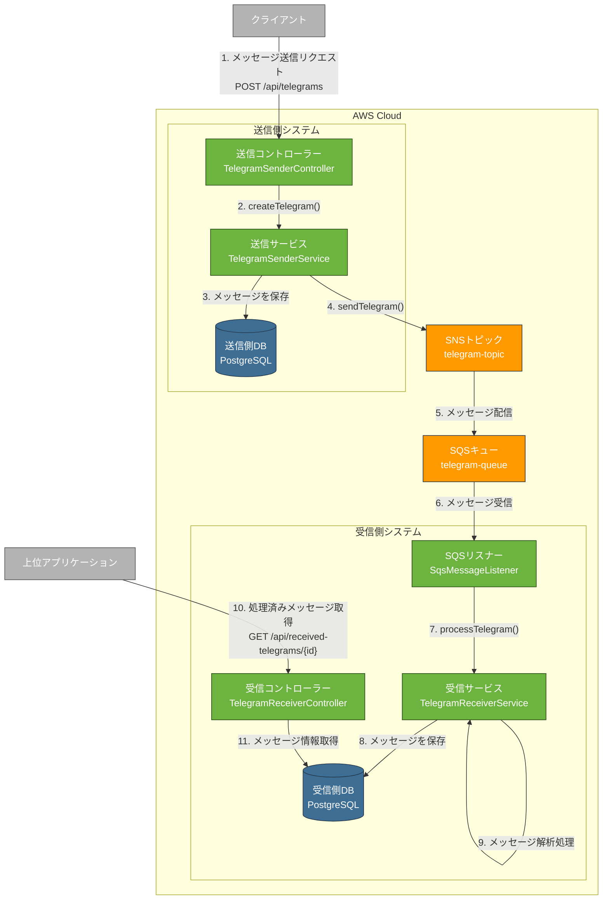

# アーキテクチャモデル




上記の図は、AWS上に構築したメッセージ送受信システムの全体アーキテクチャをmermaid.jsで表現したものです。主な要素とフローを説明します：

## 主要コンポーネント

### 送信側システム
- **送信コントローラー (TelegramSenderController)**: クライアントからのREST APIリクエストを受け付けます
- **送信サービス (TelegramSenderService)**: メッセージ作成・送信のビジネスロジックを実装しています
- **送信側DB (PostgreSQL)**: 送信メッセージの永続化を担当します

### AWS メッセージングサービス
- **SNSトピック (telegram-topic)**: Pub/Subパターンの「発行」部分を担当します
- **SQSキュー (telegram-queue)**: メッセージを一時的に格納し、受信側が処理可能なタイミングで取得できるようにします

### 受信側システム
- **SQSリスナー (SqsMessageListener)**: SQSキューからのメッセージを受信します
- **受信サービス (TelegramReceiverService)**: 受信メッセージの処理ロジックを実装しています
- **受信側DB (PostgreSQL)**: 受信メッセージの永続化を担当します
- **受信コントローラー (TelegramReceiverController)**: 処理済みメッセージの照会APIを提供します

## 処理フロー

1. クライアントが送信コントローラーにメッセージ送信リクエストを送信
2. 送信コントローラーが送信サービスの処理を呼び出し
3. 送信サービスがメッセージをデータベースに保存（DBに永続化）
4. 送信サービスがSNSトピックにメッセージを送信
5. SNSトピックから購読しているSQSキューにメッセージが配信される
6. 受信側のSQSリスナーがキューからメッセージを受信
7. リスナーが受信サービスの処理メソッドを呼び出し
8. 受信サービスがメッセージをデータベースに保存（DBに永続化）
9. 受信サービスがメッセージの解析処理を実行
10. 上位アプリケーションが受信コントローラーに処理済みメッセージの照会を行う
11. 受信コントローラーがDBからメッセージ情報を取得して返却

このアーキテクチャは、SNSとSQSを組み合わせたPub/Subパターンを採用することで、送信側と受信側のシステムを疎結合にし、信頼性の高い非同期通信を実現しています。

---

アプリケーション構成
```
telegram_messaging_sample/
├── pom.xml
├── src/
│   ├── main/
│   │   ├── java/
│   │   │   └── com/
│   │   │       └── example/
│   │   │           └── telegram/
│   │   │               ├── TelegramApplication.java
│   │   │               ├── config/
│   │   │               │   ├── AwsConfig.java
│   │   │               │   └── DatabaseConfig.java
│   │   │               ├── sender/
│   │   │               │   ├── controller/
│   │   │               │   │   └── TelegramSenderController.java
│   │   │               │   ├── service/
│   │   │               │   │   └── TelegramSenderService.java
│   │   │               │   ├── repository/
│   │   │               │   │   └── TelegramSenderRepository.java
│   │   │               │   └── model/
│   │   │               │       └── TelegramMessage.java
│   │   │               ├── receiver/
│   │   │               │   ├── controller/
│   │   │               │   │   └── TelegramReceiverController.java
│   │   │               │   ├── service/
│   │   │               │   │   └── TelegramReceiverService.java
│   │   │               │   ├── repository/
│   │   │               │   │   └── TelegramReceiverRepository.java
│   │   │               │   └── listener/
│   │   │               │       └── SqsMessageListener.java
│   │   │               └── common/
│   │   │                   ├── dto/
│   │   │                   │   └── TelegramDto.java
│   │   │                   └── exception/
│   │   │                       └── TelegramException.java
│   │   └── resources/
│   │       ├── application.yml
│   │       ├── application-dev.yml
│   │       └── db/
│   │           └── migration/
│   │               ├── V1__Create_telegram_sender_table.sql
│   │               └── V2__Create_telegram_receiver_table.sql
│   └── test/
│       └── java/
│           └── com/
│               └── example/
│                   └── telegram/
│                       ├── sender/
│                       │   └── service/
│                       │       └── TelegramSenderServiceTest.java
│                       └── receiver/
│                           └── service/
│                               └── TelegramReceiverServiceTest.java
└── README.md
```

